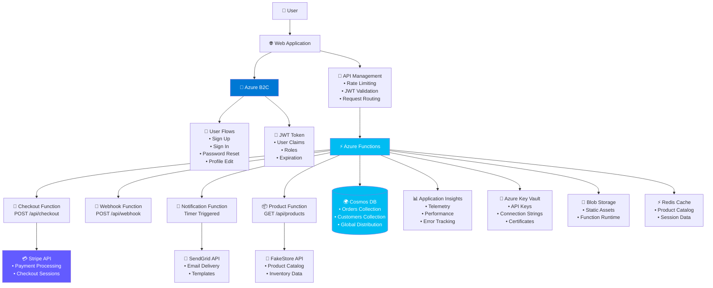
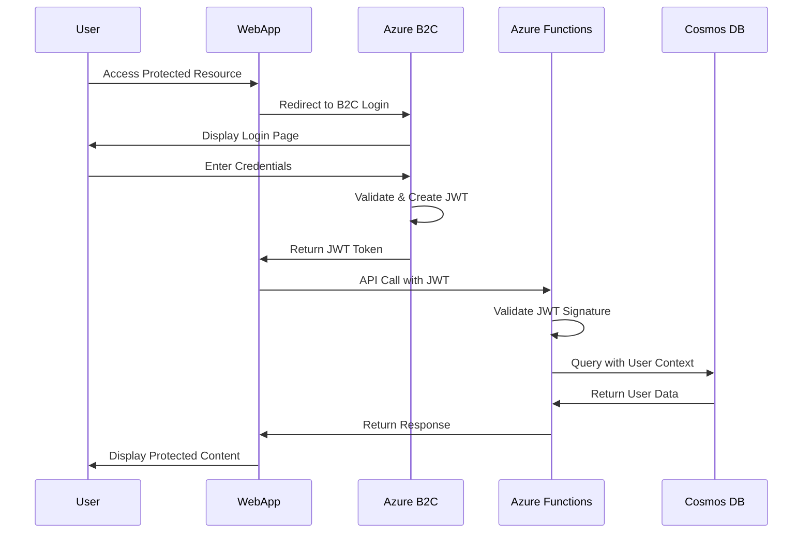

# Serverless Stripe Workflow - Architecture v2.0

## Azure B2C Integration & Azure Functions Deployment

### Executive Summary

This document outlines the updated architecture for the Serverless Stripe Workflow system, emphasizing **Azure B2C for identity management** and **Azure Functions for serverless deployment**. The architecture eliminates custom authentication complexity while providing enterprise-grade security and scalability.

## Core Architectural Principles

### 1. **Identity Delegation Strategy**

- **Azure B2C handles all identity concerns** (registration, login, password reset, MFA)
- **Application focuses on business logic** without authentication complexity
- **Zero custom identity code** - all handled by Microsoft's enterprise platform

### 2. **Serverless-First Design**

- **Azure Functions** for all API endpoints and background processing
- **Event-driven architecture** with Cosmos DB change feed triggers
- **Auto-scaling** based on demand with pay-per-execution pricing

### 3. **Multi-Cloud Compatibility**

- **Primary deployment**: Azure (Azure Functions + Cosmos DB)
- **Secondary deployment**: AWS (Lambda + DynamoDB) - maintained for comparison
- **Shared business logic** - same domain models work across both platforms

## System Architecture Overview



## Authentication & Authorization Architecture

### Azure B2C Integration



### B2C Configuration Requirements

#### **User Flows**

```json
{
  "signUpSignIn": {
    "name": "B2C_1_signup_signin",
    "userAttributes": ["email", "givenName", "surname"],
    "applicationClaims": ["email", "name", "sub", "roles"]
  },
  "passwordReset": {
    "name": "B2C_1_password_reset",
    "enableSelfService": true
  },
  "profileEdit": {
    "name": "B2C_1_profile_edit",
    "editableAttributes": ["givenName", "surname", "preferences"]
  }
}
```

#### **Custom Attributes for Authorization**

```json
{
  "customAttributes": {
    "roles": {
      "dataType": "stringCollection",
      "values": ["customer", "admin", "support"]
    },
    "preferredCurrency": {
      "dataType": "string",
      "defaultValue": "USD"
    },
    "timezone": {
      "dataType": "string",
      "defaultValue": "UTC"
    }
  }
}
```

## Azure Functions Architecture

### Function Structure

```
📁 src/functions/
├── 📁 checkout/
│   ├── function.json              # Trigger configuration
│   ├── CheckoutFunction.cs        # HTTP trigger
│   └── host.json                  # Function app settings
├── 📁 webhook/
│   ├── function.json              # HTTP trigger for Stripe
│   └── WebhookFunction.cs         # Webhook processing
├── 📁 notification/
│   ├── function.json              # Timer trigger
│   └── NotificationFunction.cs    # Background processing
└── 📁 products/
    ├── function.json              # HTTP trigger
    └── ProductFunction.cs         # Product catalog API
```

### Function App Configuration

#### **host.json**

```json
{
  "version": "2.0",
  "functionTimeout": "00:05:00",
  "extensions": {
    "http": {
      "routePrefix": "api",
      "maxConcurrentRequests": 100
    },
    "cosmosDB": {
      "connectionStringSetting": "CosmosDB_ConnectionString"
    }
  },
  "logging": {
    "applicationInsights": {
      "samplingSettings": {
        "isEnabled": true,
        "maxTelemetryItemsPerSecond": 20
      }
    }
  }
}
```

#### **Function-Level Configuration**

```json
{
  "bindings": [
    {
      "authLevel": "anonymous",
      "type": "httpTrigger",
      "direction": "in",
      "name": "req",
      "methods": ["post"],
      "route": "checkout"
    },
    {
      "type": "cosmosDB",
      "direction": "out",
      "name": "orderOut",
      "databaseName": "StripeWorkflow",
      "collectionName": "Orders",
      "connectionStringSetting": "CosmosDB_ConnectionString"
    }
  ]
}
```

### JWT Validation in Azure Functions

```csharp
public class AuthenticationMiddleware
{
    private readonly IConfiguration _configuration;
    private readonly JwtSecurityTokenHandler _tokenHandler;

    public async Task<ClaimsPrincipal> ValidateB2CToken(string token)
    {
        var validationParameters = new TokenValidationParameters
        {
            ValidateIssuer = true,
            ValidIssuer = $"https://{_configuration["B2C:TenantName"]}.b2clogin.com/{_configuration["B2C:TenantId"]}/v2.0/",
            ValidateAudience = true,
            ValidAudience = _configuration["B2C:ClientId"],
            ValidateLifetime = true,
            ClockSkew = TimeSpan.FromMinutes(5),
            IssuerSigningKeyResolver = (token, securityToken, kid, parameters) =>
            {
                // Get B2C signing keys from JWKS endpoint
                return GetB2CSigningKeys(kid);
            }
        };

        var principal = _tokenHandler.ValidateToken(token, validationParameters, out var validatedToken);
        return principal;
    }
}
```

## Data Architecture with Cosmos DB

### Collection Design

#### **Orders Collection**

```json
{
  "id": "order_123456789",
  "partitionKey": "customer_abc123",
  "orderData": {
    "customerId": "customer_abc123",
    "status": "Paid",
    "items": [
      {
        "productId": "prod_1",
        "quantity": 2,
        "unitPrice": {
          "amount": 29.99,
          "currency": "USD"
        }
      }
    ],
    "totalAmount": {
      "amount": 59.98,
      "currency": "USD"
    },
    "createdAt": "2025-10-18T10:00:00Z",
    "stripeSessionId": "cs_test_123"
  },
  "_ts": 1729246800
}
```

#### **Change Feed Triggers**

```csharp
[FunctionName("OrderChangeProcessor")]
public static async Task ProcessOrderChanges(
    [CosmosDBTrigger(
        databaseName: "StripeWorkflow",
        collectionName: "Orders",
        ConnectionStringSetting = "CosmosDB_ConnectionString",
        LeaseCollectionName = "leases")] IReadOnlyList<Document> orders,
    ILogger log)
{
    foreach (var order in orders)
    {
        // Process order status changes
        // Trigger notifications
        // Update analytics
        await ProcessOrderStatusChange(order);
    }
}
```

## Deployment Architecture

### Infrastructure as Code (ARM Templates)

#### **Cost-Optimized ARM Template**

```json
{
  "$schema": "https://schema.management.azure.com/schemas/2019-04-01/deploymentTemplate.json#",
  "contentVersion": "1.0.0.0",
  "parameters": {
    "environmentName": { "type": "string" },
    "b2cTenantName": { "type": "string" },
    "stripePublishableKey": { "type": "securestring" }
  },
  "resources": [
    {
      "type": "Microsoft.Web/sites",
      "apiVersion": "2021-02-01",
      "name": "[concat('func-', parameters('environmentName'))]",
      "properties": {
        "serverFarmId": null,
        "siteConfig": {
          "appSettings": [
            {
              "name": "FUNCTIONS_WORKER_RUNTIME",
              "value": "dotnet-isolated"
            },
            {
              "name": "FUNCTIONS_EXTENSION_VERSION",
              "value": "~4"
            }
          ]
        }
      },
      "kind": "functionapp"
    },
    {
      "type": "Microsoft.DocumentDB/databaseAccounts",
      "apiVersion": "2021-10-15",
      "name": "[concat('cosmos-', parameters('environmentName'))]",
      "properties": {
        "databaseAccountOfferType": "Standard",
        "capabilities": [
          {
            "name": "EnableServerless"
          }
        ]
      }
    }
  ]
}
```

### CI/CD Pipeline (GitHub Actions)

```yaml
name: Deploy to Azure
on:
  push:
    branches: [main]
    paths: ["src/functions/**", "infrastructure/**"]

env:
  AZURE_FUNCTIONAPP_NAME: stripe-workflow-functions
  AZURE_FUNCTIONAPP_PACKAGE_PATH: "./src/functions"

jobs:
  deploy:
    runs-on: ubuntu-latest
    steps:
      - uses: actions/checkout@v3

      - name: Setup .NET
        uses: actions/setup-dotnet@v3
        with:
          dotnet-version: "8.0"

      - name: Build Functions
        run: |
          dotnet build ${{ env.AZURE_FUNCTIONAPP_PACKAGE_PATH }} \
            --configuration Release --output ./output

      - name: Deploy Infrastructure
        uses: azure/arm-deploy@v1
        with:
          subscriptionId: ${{ secrets.AZURE_SUBSCRIPTION_ID }}
          resourceGroupName: ${{ secrets.AZURE_RESOURCE_GROUP }}
          template: ./infrastructure/main.bicep
          parameters: environmentName=prod b2cTenantName=${{ secrets.B2C_TENANT }}

      - name: Deploy Functions
        uses: Azure/functions-action@v1
        with:
          app-name: ${{ env.AZURE_FUNCTIONAPP_NAME }}
          package: "./output"
```

## Security Architecture

### Zero-Trust Security Model

#### **API Security Layers**

1. **Azure B2C JWT Validation** - Identity verification
2. **API Management Policies** - Rate limiting and request validation
3. **Function-Level Authorization** - Role-based access control
4. **Cosmos DB RBAC** - Data-level permissions
5. **Key Vault Integration** - Secure secret management

#### **Data Protection**

```csharp
public class DataProtectionService
{
    public async Task<string> EncryptSensitiveData(string plaintext)
    {
        // Use Azure Key Vault managed keys
        var keyClient = new KeyClient(vaultUri, credential);
        var encryptResult = await keyClient.EncryptAsync(
            EncryptionAlgorithm.RsaOaep256,
            Encoding.UTF8.GetBytes(plaintext));
        return Convert.ToBase64String(encryptResult.Ciphertext);
    }
}
```

## Monitoring & Observability

### Application Insights Integration

#### **Custom Telemetry**

```csharp
public class TelemetryService
{
    private readonly TelemetryClient _telemetryClient;

    public void TrackOrderEvent(string orderId, OrderStatus status)
    {
        _telemetryClient.TrackEvent("OrderStatusChanged", new Dictionary<string, string>
        {
            ["OrderId"] = orderId,
            ["Status"] = status.ToString(),
            ["Timestamp"] = DateTimeOffset.UtcNow.ToString()
        });
    }

    public void TrackPerformanceMetric(string operationName, TimeSpan duration)
    {
        _telemetryClient.TrackMetric($"Performance.{operationName}", duration.TotalMilliseconds);
    }
}
```

#### **Health Checks**

```csharp
[FunctionName("HealthCheck")]
public static async Task<IActionResult> HealthCheck(
    [HttpTrigger(AuthorizationLevel.Anonymous, "get", Route = "health")] HttpRequest req,
    [CosmosDB(ConnectionStringSetting = "CosmosDB_ConnectionString")] DocumentClient client)
{
    var healthStatus = new
    {
        Status = "Healthy",
        Timestamp = DateTimeOffset.UtcNow,
        Dependencies = new
        {
            CosmosDb = await CheckCosmosDbHealth(client),
            StripeApi = await CheckStripeApiHealth(),
            FakeStoreApi = await CheckFakeStoreApiHealth()
        }
    };

    return new OkObjectResult(healthStatus);
}
```

## Performance & Scalability

### Auto-Scaling Configuration

#### **Serverless Auto-Scaling (Cost Optimized)**

```json
{
  "functionApp": {
    "plan": "Consumption",
    "scaleLimit": 200,
    "alwaysReady": 0,
    "preWarmedInstances": 0
  },
  "cosmosDb": {
    "mode": "Serverless",
    "autoScale": true,
    "maxRequestUnits": "Auto-managed by Azure"
  }
}
```

#### **Serverless Cosmos DB (No Manual Scaling Needed)**

```csharp
public class CosmosServerlessService
{
    // Serverless Cosmos DB automatically scales
    // No manual RU management required
    // Pay only for consumed Request Units

    public async Task<ItemResponse<Order>> CreateOrderAsync(Order order)
    {
        // Cosmos DB serverless automatically handles scaling
        var container = _cosmosClient.GetContainer("StripeWorkflow", "Orders");
        return await container.CreateItemAsync(order, new PartitionKey(order.CustomerId));
    }

    // Cost is automatically optimized:
    // - Pay per request (RU consumed)
    // - No provisioned throughput
    // - Automatic scaling to zero when idle
}
```

## Migration Strategy

### Phase 1: Infrastructure Setup (Week 1)

- [ ] Set up Azure B2C tenant and configure user flows
- [ ] Deploy Azure Functions infrastructure via ARM templates
- [ ] Configure Cosmos DB with proper scaling and global distribution
- [ ] Set up Application Insights and monitoring dashboards

### Phase 2: Authentication Integration (Week 2)

- [ ] Update frontend to integrate with Azure B2C
- [ ] Implement JWT validation middleware in Azure Functions
- [ ] Test user registration, login, and role-based access
- [ ] Configure API Management for rate limiting and security

### Phase 3: Function Migration (Week 3)

- [ ] Deploy existing handlers as Azure Functions
- [ ] Configure Cosmos DB bindings and change feed triggers
- [ ] Set up CI/CD pipeline with GitHub Actions
- [ ] Perform load testing and performance validation

### Phase 4: Production Deployment (Week 4)

- [ ] Configure custom domain and SSL certificates
- [ ] Set up monitoring alerts and dashboards
- [ ] Perform security testing and penetration testing
- [ ] Go live with full production traffic

## Cost Optimization

### Resource Sizing Strategy (Cost-Conscious Portfolio Approach)

- **Functions**: Consumption Plan (pay-per-execution) - FREE for first 1M executions
- **Cosmos DB**: Serverless mode (pay-per-request) - FREE for first 1000 RU/s + 25GB
- **B2C**: Free tier supports up to 50,000 users/month - FREE
- **Application Insights**: Free tier (5GB/month) with aggressive sampling - FREE
- **Static Web Apps**: FREE hosting for frontend
- **Storage Account**: Locally Redundant Storage (LRS) - ~$2/month

### Estimated Monthly Costs (Portfolio/Demo)

**Development & Demo Usage:**

- Azure Functions (Consumption): FREE (under 1M executions)
- Cosmos DB (Serverless): FREE (under free tier limits)
- Azure B2C (Free): FREE (under 50K users)
- Application Insights (Free): FREE (under 5GB)
- Static Web Apps: FREE
- Storage Account: ~$2/month
- **Total**: ~$2-5/month for demo usage

**Production Scale (if needed):**

- Azure Functions (Consumption): ~$10-20/month
- Cosmos DB (Serverless): ~$25-50/month
- Application Insights: ~$10/month
- **Total**: ~$45-80/month for production usage

### Cost-Conscious Architecture Decisions

1. **Serverless-Only**: No always-on compute costs
2. **Free Tier Maximization**: Leverage all available free tiers
3. **Pay-Per-Use**: Only pay for actual usage, not reserved capacity
4. **Local Development**: Use emulators to minimize cloud costs during development

---

## Next Steps

1. **Review and approve this architecture** - Confirm Azure B2C approach meets requirements
2. **Set up Azure B2C tenant** - Create and configure user flows
3. **Begin infrastructure deployment** - Start with ARM template creation
4. **Update integration tests** - Add B2C token validation testing

This architecture eliminates authentication complexity while providing enterprise-grade security and scalability through Azure's managed services.
