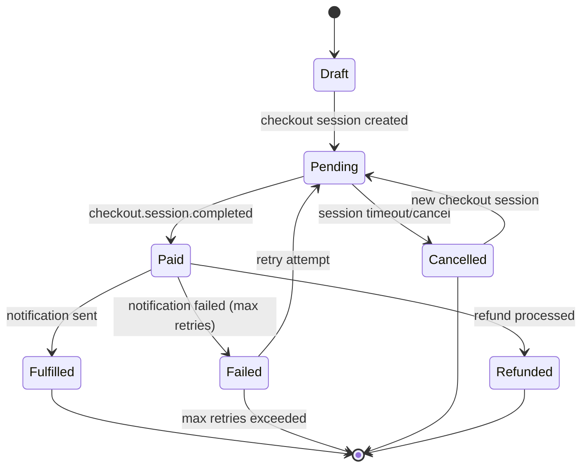

# Shared Handlers Library

This library contains the core business logic for the Stripe workflow application, implemented as platform-agnostic handlers that can be used by both Azure Functions and AWS Lambda hosting adapters.

## Architecture

The shared handlers follow the hexagonal architecture pattern, separating business logic from infrastructure concerns:

- **Domain**: Contains entity models, repository interfaces, and service interfaces
- **Handlers**: Contains the core business logic handlers that orchestrate domain operations

## Handlers

### CheckoutHandler

Handles the creation of checkout sessions and order management.

**Key Features:**

- Validates and enriches order items with product data
- Creates orders with proper state management
- Integrates with Stripe for checkout session creation
- Maintains order version for optimistic concurrency

### WebhookHandler

Processes Stripe webhook events to update order states.

**Supported Events:**

- `checkout.session.completed` - Transitions order from Pending to Paid and triggers notifications

**Key Features:**

- Webhook signature validation
- Atomic state transitions with version control
- Automatic notification triggering for successful payments
- Comprehensive error handling and logging

### NotificationHandler

Manages order fulfillment notifications to external systems.

**Key Features:**

- Sends webhook notifications for paid orders
- Retry logic with configurable max attempts
- Transitions orders to Fulfilled status on successful notification
- Batch retry processing for failed notifications

## Order State Machine



## Dependency Injection

Register all handlers using the extension method:

```csharp
services.AddStripeWorkflowHandlers();
```

## Dependencies

The handlers depend on the following interfaces that must be implemented by the hosting layer:

- `IOrderRepository` - Order persistence operations
- `IProductCatalogService` - Product catalog integration (FakeStore API)
- `IPaymentService` - Stripe integration
- `INotificationService` - HTTP notification delivery

## Usage Example

```csharp
// In Azure Functions or AWS Lambda hosting adapter
public async Task<IActionResult> CreateCheckout(
    [HttpTrigger] CheckoutRequest request,
    [Inject] CheckoutHandler handler)
{
    var response = await handler.CreateCheckoutSessionAsync(request);
    return new OkObjectResult(response);
}
```

## Error Handling

All handlers implement comprehensive error handling:

- Input validation with meaningful error messages
- Structured logging for debugging and monitoring
- Graceful degradation for external service failures
- Proper exception propagation to hosting layers

## Concurrency Control

The handlers use optimistic concurrency control through entity versioning:

- Version field incremented on each update
- State transitions validate current version
- Concurrent modification attempts are rejected
- Ensures data consistency across distributed operations
